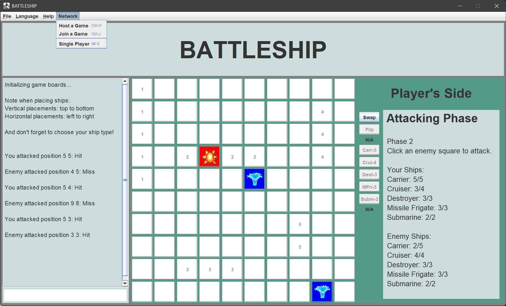

# Battleship

Recreation of the popular game Battleship with Java backend and Swing frontend with the following features:
- MVC architecture
- A network component added in the backend so players can play against each other
- Developer mode where the player can see the computer opponent's board when playing
- Some internatonalization to translate between English and Tagalog

 

